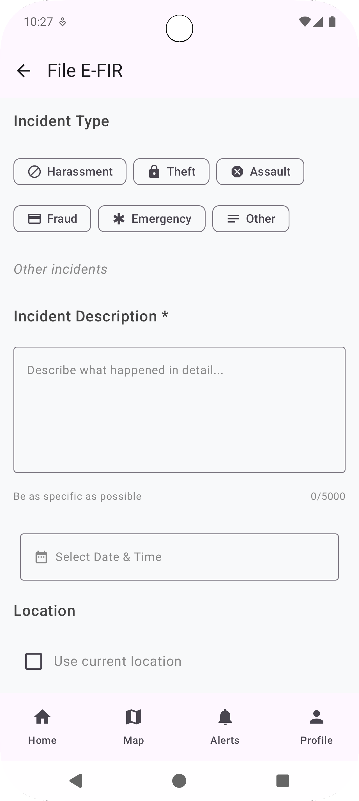
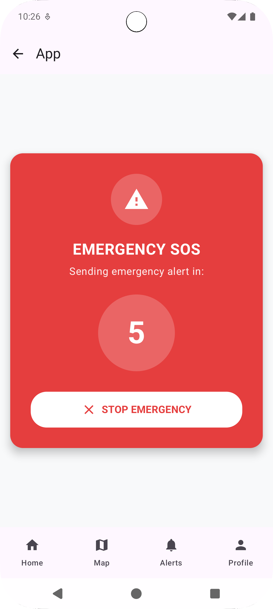
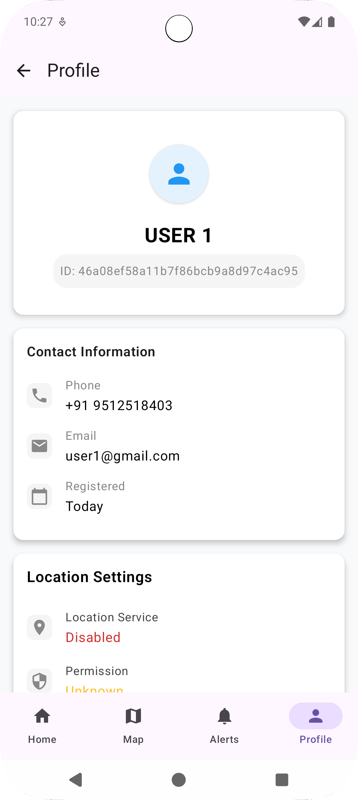

# Smart Tourist Safety Monitoring & Incident Response System

## Overview

The Smart Tourist Safety Monitoring & Incident Response System is a comprehensive mobile application designed to enhance tourist safety through real-time monitoring, incident reporting, and emergency response capabilities. This Android application provides tourists with essential safety tools while enabling authorities to monitor and respond to incidents effectively.

## Features

### 🛡️ Safety Monitoring
- Real-time location tracking for emergency situations
- Geofence alerts for unsafe areas
- Weather and safety condition updates
- Emergency contact integration

### 📱 E-FIR
- Quick incident reporting with location tagging
- Photo and video evidence upload
- Categorized incident types (medical, security, natural disasters)
- Real-time status updates on reported incidents

### 🚨 Emergency Response
- One-tap emergency calling
- Automatic location sharing with emergency services
- Integration with local emergency services
- Safety alerts and notifications

### 👥 Tourist Services
- Tourist-friendly interface in multiple languages
- Nearby hospital and police station locator
- Safety tips and guidelines
- Travel advisory notifications

## Screenshots

### Home Screen
<div align="center">

</div>

### E-FIR
<div align="center">

</div>

### Emergency Dashboard
<div align="center">

</div>

### Safety Map View
<div align="center">

</div>

### Profile & Settings
<div align="center">

</div>

## Technical Specifications

### Platform
- **Target Platform**: Android
- **Minimum SDK**: API 24 (Android 7.0)
- **Target SDK**: API 34 (Android 14)
- **Development Language**: Kotlin
- **Architecture**: MVVM (Model-View-ViewModel)

### Key Technologies
- **UI Framework**: Jetpack Compose / XML Layouts
- **Navigation**: Android Navigation Component
- **Networking**: Retrofit with OkHttp
- **Database**: Room Database
- **Maps**: Google Maps SDK
- **Real-time Communication**: Firebase Cloud Messaging
- **Authentication**: Firebase Auth
- **Image Processing**: Glide/Picasso
- **Location Services**: Google Location Services

## Installation

### Prerequisites
- Android Studio Arctic Fox or later
- Android SDK API 24 or higher
- Google Play Services
- Valid Google Maps API key

### Setup Instructions

1. **Clone the Repository**
   ```bash
   git clone https://github.com/Pratham200Rajbhar/24172012068_ASSIGNMENT.git
   cd 24172012068_ASSIGNMENT
   ```

2. **Configure API Keys**
   - Add your Google Maps API key to `local.properties`
   - Configure Firebase project settings
   - Update emergency service API endpoints

3. **Build and Run**
   ```bash
   ./gradlew assembleDebug
   ```

## App Architecture

### Core Modules
- **Authentication Module**: User registration and login
- **Location Module**: GPS tracking and geofencing
- **Incident Module**: Incident reporting and management
- **Emergency Module**: Emergency response and contacts
- **Notification Module**: Real-time alerts and updates
- **Map Module**: Interactive safety maps

### Data Flow
```
User Interface → ViewModel → Repository → Network/Local Database
```

## Safety Features

### Emergency Response System
- **Panic Button**: One-tap emergency activation
- **Automatic Location Broadcasting**: Shares precise location with emergency contacts
- **Silent Alert Mode**: Discrete emergency notification
- **Emergency Contact Management**: Quick access to predefined emergency contacts

### Incident Management
- **Real-time Incident Tracking**: Live updates on incident status
- **Evidence Collection**: Photo, video, and audio recording capabilities
- **Incident Categories**: Medical, security, natural disaster, theft, etc.
- **Follow-up System**: Automatic status updates and resolution tracking

## User Interface

### Design Principles
- **Tourist-Friendly**: Intuitive interface designed for travelers
- **Multilingual Support**: Available in multiple languages
- **Accessibility**: WCAG 2.1 compliant for users with disabilities
- **Offline Capability**: Essential features work without internet connection

### Key Screens
- **Dashboard**: Quick access to all safety features
- **Map View**: Interactive safety map with incident markers
- **E-FIR**: Step-by-step incident reporting process
- **Emergency Panel**: Emergency contacts and response options
- **Profile Management**: Personal information and preferences

## Security & Privacy

### Data Protection
- End-to-end encryption for sensitive communications
- GDPR compliant data handling
- Secure storage of personal information
- Regular security audits and updates

### Privacy Features
- Optional location sharing
- Data anonymization for reporting
- User-controlled privacy settings
- Clear data retention policies

## Testing

### Test Coverage
- **Unit Tests**: Core business logic validation
- **Integration Tests**: API and database interactions
- **UI Tests**: User interface automation
- **Security Tests**: Penetration testing and vulnerability assessment

### Testing Strategy
```bash
# Run unit tests
./gradlew test

# Run instrumented tests
./gradlew connectedAndroidTest

# Generate test reports
./gradlew jacocoTestReport
```

## Development Team

### Contributors
- **Developer**: Pratham Rajbhar (24172012068)
- **Project Type**: Mobile Application Development Assignment
- **Academic Year**: 2024-2025

### Contact Information
- **Repository**: [GitHub Repository](https://github.com/Pratham200Rajbhar/24172012068_ASSIGNMENT)
- **Issues**: Report bugs and feature requests through GitHub Issues
- **Documentation**: Comprehensive documentation available in `/docs` folder

## License

This project is developed as part of an academic assignment and is intended for educational purposes.

## Acknowledgments

- Thanks to emergency service providers for their input on safety requirements
- Tourism boards for providing safety guidelines and best practices
- Open-source community for the tools and libraries used in this project

---

**Note**: This application is designed to complement, not replace, official emergency services. In case of real emergencies, always contact local emergency services directly.

## Version History

| Version | Release Date | Key Features |
|---------|--------------|--------------|
| 1.0.0   | TBD          | Initial release with core safety features |
| 1.1.0   | TBD          | Enhanced incident reporting |
| 1.2.0   | TBD          | Multilingual support |

---

*Last updated: November 2024*